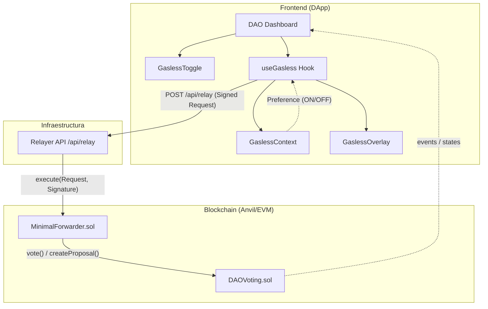

# Arquitectura del Sistema de Meta-Transacciones

Esta especificación detalla la estructura técnica y la interacción de los componentes del sistema Gasless.

## Diagrama de Componentes

## Componentes Clave

### 1. `useGasless` (Hook de Lógica)
El cerebro de la integración. Gestiona:
- Firma EIP-712.
- Comunicación con el Relayer.
- Orquestación de estados y timeouts (30s).
- Gestión del ciclo de vida de la transacción.

### 2. `GaslessContext` (Gestión de Preferencia)
Mantiene el estado global de si el usuario desea realizar acciones Gasless o no. Persistente en `localStorage`.

### 3. `Relayer API` (API Route Next.js)
Actúa como intermediario que paga el gas.
- **Validaciones**: Verifica firma, nonce, balance y que la transacción vaya a funciones permitidas (`vote`, `createProposal`).
- **Endpoint**: `POST /api/relay`.

### 4. `GaslessOverlay` (UI de Estado)
Componente premium que "flota" sobre la UI principal durante una transacción para:
- Bloquear interacciones duplicadas.
- Informar el estado actual (signing, relaying, etc.).
- Ofrecer botones de acción en caso de éxito, error o fallback.

### 5. Sincronización de Sesión (EIP-1193)
Existe una dependencia estricta con el proveedor inyectado (MetaMask) a nivel de abstracción de red:
- **`accountsChanged`**: Reactividad inmediata ante cambios o cierres de sesión externos. Si el array de cuentas está vacío, el sistema aborta la sesión y rehidrata un estado inicial por seguridad, eliminando sincronizaciones erróneas.
- **`disconnect`**: Sincronización para limpieza de estado (store global) previniendo fuga de permisos o transacciones residuales.
