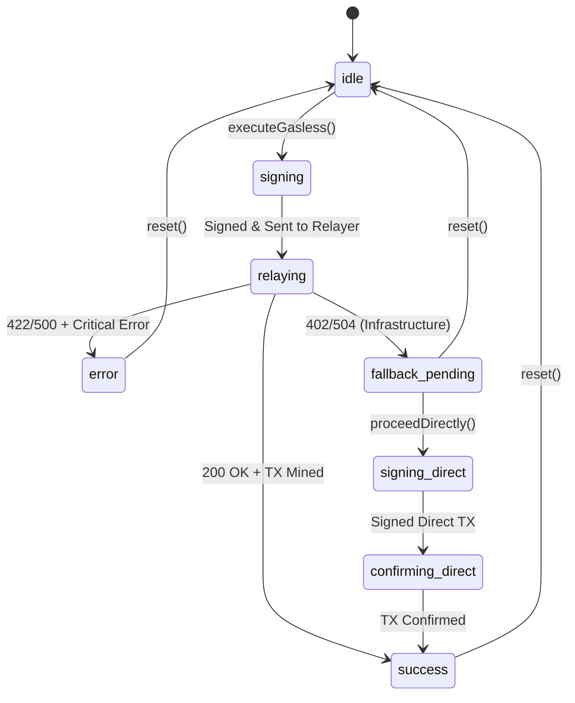

# Máquina de Estados del Sistema Gasless

Esta especificación detalla el funcionamiento interno del componente `useGasless`.

## Diagrama de Estados

## Estados Definidos

| Estado | Significado | UX Visual |
| :--- | :--- | :--- |
| `idle` | Estado inicial, esperando acción. | Sin cambios. |
| `signing` | El usuario está firmando la meta-transacción. | Modal de firma abierto. |
| `relaying` | El Relayer está procesando/enviando el gas. | Animación de envío. |
| `confirming` | Esperando confirmación de bloques. | Loader de confirmación. |
| `success` | Transacción completada y registrada. | Checkmark verde + confeti. |
| `error` | Fallo crítico (firma inválida, revert). | Icono de error + razón. |
| `fallback_pending` | El Relayer falló (sin fondos/tiempo). | Pregunta por ejecución directa. |
| `DISCONNECTED` | El proveedor cortó la conexión (trigger: `accountsChanged -> []`). | Forzado a reset global + Landing. |

## Manejo de Errores e Infraestructura

### Errores de Infraestructura (Disparan Fallback)
- `RELAYER_INSUFFICIENT_FUNDS`
- `TIMEOUT` / `ABORT_ERROR`
- `NETWORK_ERROR`

### Errores Críticos (No disparan Fallback)
- `INVALID_SIGNATURE`
- `INVALID_NONCE` (Indica posible ataque o desincronización)
- `EXECUTION_FAILED` (Contrato revirtió, la lógica falló)
- `UNSUPPORTED_ACTION` (Función no permitida)
