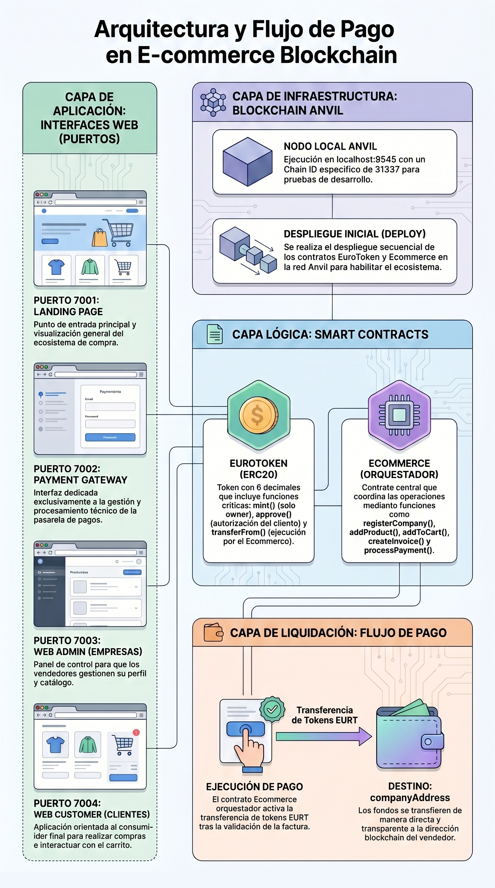

# E-Commerce Web3 con EuroToken

Sistema de comercio electrónico descentralizado construido en Ethereum, que utiliza el token estable **EuroToken (EURT)** para pagos. Este ecosistema consta de smart contracts y tres micro-frontends independientes.

---

## 📋 Índice

- [Estructura del Proyecto](#estructura-del-proyecto)
- [Smart Contracts](#smart-contracts)
- [Micro-frontends](#micro-frontends)
- [ Arquitectura de Datos](#arquitectura-de-datos)
- [Flujo de Compra Completo](#flujo-de-compra-completo)
- [Configuración y Deployment](#configuración-y-deployment)
- [Tests](#tests)
- [Scripts de Orquestación](#scripts-de-orquestación)
- [Documentación Detallada](#documentación-detallada)

---

## 📁 Estructura del Proyecto

```
doing/03-ecommerce-doing/
├── stablecoin/               # Token EuroToken (EURT) y landing de compra
│   ├── sc/eurotoken/         # Smart contract EURT (ERC20)
│   │   ├── src/EuroToken.sol
│   │   ├── test/EuroToken.t.sol
│   │   └── script/DeployEuroToken.s.sol
│   └── web-landing/          # App Next.js para compra de EURT con Stripe (puerto 7001)
│
├── ecommerce/               # Sistema de e-commerce principal
│   ├── sc/                  # Smart contracts del e-commerce
│   │   ├── src/
│   │   │   ├── Ecommerce.sol
│   │   │   └── libraries/
│   │   │       ├── CompanyLib.sol
│   │   │       ├── CustomerLib.sol
│   │   │       ├── ProductLib.sol
│   │   │       ├── CartLib.sol
│   │   │       ├── InvoiceLib.sol
│   │   │       └── PaymentLib.sol
│   │   ├── test/
│   │   │   ├── CompanyTest.t.sol
│   │   │   ├── ProductTest.t.sol
│   │   │   ├── CartTest.t.sol
│   │   │   ├── InvoiceTest.t.sol
│   │   │   ├── PaymentTest.t.sol
│   │   │   ├── CustomerTest.t.sol
│   │   │   └── IntegrationTest.t.sol
│   │   ├── script/
│   │   │   ├── DeployEcommerce.s.sol
│   │   │   └── SeedEcommerce.s.sol
│   │   └── foundry.toml
│   │
│   ├── web-admin/            # Panel de administración (puerto 7003)
│   │   ├── app/
│   │   │   ├── companies/page.tsx
│   │   │   ├── (company)/
│   │   │   │   ├── products/page.tsx
│   │   │   │   ├── invoices/page.tsx
│   │   │   │   └── customers/page.tsx
│   │   │   └── layout.tsx
│   │   ├── components/
│   │   │   ├── modern-ui/      # Sistema de diseño Terra Viva
│   │   │   ├── CompanyInfoCard.tsx
│   │   │   ├── CompanyTabs.tsx
│   │   │   ├── ConnectDialog.tsx
│   │   │   ├── CustomersTable.tsx
│   │   │   ├── InvoicesTable.tsx
│   │   │   └── ...
│   │   └── lib/
│   │       ├── web3/
│   │       │   ├── WalletContext.tsx
│   │       │   ├── contract.ts
│   │       │   ├── formatters.ts
│   │       │   └── roleDetection.ts
│   │       └── abi/
│   │
│   ├── web-customer/         # Tienda online (puerto 7004)
│   │   ├── app/
│   │   │   ├── page.tsx              # Catálogo de productos
│   │   │   ├── cart/page.tsx         # Carrito de compra
│   │   │   ├── checkout/pay/page.tsx # Pago (integrado con gateway)
│   │   │   ├── orders/page.tsx       # Historial de órdenes
│   │   │   └── layout.tsx
│   │   ├── components/
│   │   │   └── modern-ui/            # Sistema de diseño Terra Viva
│   │   ├── lib/
│   │   │   ├── contexts/
│   │   │   │   ├── CartContext.tsx
│   │   │   │   └── OrdersContext.tsx
│   │   │   ├── web3/
│   │   │   │   ├── WalletContext.tsx
│   │   │   │   ├── contracts.ts
│   │   │   │   └── formatters.ts
│   │   │   └── abi/
│   │   └── src/components/product/ProductCard.tsx
│   │
│   └── web-payment-gateway/  # Pasarela de pago (puerto 7002)
│       ├── app/
│       │   ├── page.tsx
│       │   └── layout.tsx
│       ├── components/
│       │   ├── modern-ui/
│       │   ├── PaymentContainer.tsx
│       │   ├── PaymentDetailsCard.tsx
│       │   └── payment/
│       │       └── PaymentConfirmed.tsx
│       ├── lib/
│       │   ├── hooks/
│       │   │   └── usePaymentParams.ts
│       │   ├── web3/
│       │   │   ├── WalletContext.tsx
│       │   │   ├── contracts.ts
│       │   │   └── formatters.ts
│       │   └── abi/
│       └── package.json
│
├── restart-all.sh            # Orquestador completo del sistema
├── sync-env.sh               # Sincroniza variables de entorno
└── anvil.log                 # Log de la blockchain local
```

---

## 🔗 Smart Contracts

### EuroToken (EURT)

Token ERC20 estable vinculado al euro.

```solidity
contract EuroToken is ERC20, ERC20Burnable, Ownable
```

**Características:**
- Nombre: `EuroToken`
- Símbolo: `EURT`
- Decimales: `6` (1 EURT = 1_000_000 unidades)
- Suministro máximo: `100,000,000 EURT` (100M × 10⁶)
- Funciones principales:
  - `mint(address to, uint256 amount)`: Solo owner, emite evento `Minted`
  - `burn(uint256 amount)`: Quema tokens del emisor
  - `burnFrom(address account, uint256 amount)`: Quema con allowance
- Integración: Usado por web-customer (para comprar EURT con Stripe en landing) y por ecommerce para pagos

**Ubicación:** `stablecoin/sc/eurotoken/src/EuroToken.sol`

### Ecommerce.sol

Contrato principal del sistema de e-commerce.

```solidity
contract Ecommerce {
    address public owner;
    address public euroTokenAddress;
    // Empresas
    uint256 public companyCount;
    mapping(uint256 => Company) private companies;
    mapping(address => uint256) private companyIdByAddress;
    // Clientes
    mapping(address => Customer) private customers;
    // Productos
    uint256 public productCount;
    mapping(uint256 => Product) private products;
    mapping(uint256 => uint256[]) private companyProductIds;
    // Carrito
    mapping(address => CartItem[]) private carts;
    // Facturas
    uint256 public invoiceCount;
    mapping(uint256 => Invoice) private invoices;
    mapping(address => uint256[]) private invoicesByCustomer;
    mapping(uint256 => uint256[]) private invoicesByCompany;
    // Pagos
    mapping(uint256 => Payment) private payments;
}
```

**Módulos por librería:**

| Librería | Responsabilidad |
|----------|----------------|
| `CompanyLib` | Registro, activación/desactivación, actualización de empresas |
| `CustomerLib` | Registro implícito (al primer `addToCart`), métricas de compra |
| `ProductLib` | CRUD de productos, control de stock, filtrado por empresa |
| `CartLib` | Gestión del carrito por usuario (add, clear, get total) |
| `InvoiceLib` | Creación de facturas desde carrito, almacenamiento de snapshot de precios |
| `PaymentLib` | Ejecución de pago (transferFrom de EURT), registro del txHash |

**Eventos principales:**
- `CompanyRegistered(companyId, companyAddress, name)`
- `CustomerRegistered(customerAddress)`
- `ProductAdded(productId, companyId, name, price, stock)`
- `CartUpdated(customerAddress, productId, quantity)`
- `InvoiceCreated(invoiceId, customerAddress, companyId, totalAmount)`
- `PaymentProcessed(invoiceId, customerAddress, amount, txHash)`

**Ubicación:** `ecommerce/sc/src/Ecommerce.sol`

---

## 🌐 Micro-frontends

### 1. Web Landing (puerto 7001)

**Rol:** Página de inicio y compra de EURT con tarjeta (Stripe).

**Stack:** Next.js 15, TypeScript, Tailwind CSS, ethers.js v6, Stripe

**Funcionalidades:**
- Landing page hero con CTA "Conectar billetera"
- Conexión MetaMask (WalletContext compartido con el ecosistema)
- Flujo de compra de EURT con Stripe (webhooks →.backend llama `EuroToken.mint()`)
- Vista de confirmación y balance

**Variables de entorno requeridas:**
```bash
NEXT_PUBLIC_EUROTOKEN_CONTRACT_ADDRESS=<dirección>
NEXT_PUBLIC_RPC_URL=http://localhost:8545
NEXT_PUBLIC_STRIPE_PUBLISHABLE_KEY=pk_test_...
STRIPE_SECRET_KEY=sk_test_...
STRIPE_WEBHOOK_SECRET=whsec_...
```

**URL:** `http://localhost:7001`

---

### 2. Web Payment Gateway (puerto 7002)

**Rol:** Procesamiento de pagos (2 transacciones: approve + processPayment).

**Stack:** Next.js 15, TypeScript, ethers.js v6, Radix UI

**Flujo de pago:**
```
1. Cliente redirige desde web-customer con URL params:
   ?invoiceId=N&companyId=N&amount=units&merchant=0x...&redirect=http://localhost:7004

2. Gateway carga datos on-chain:
   - getInvoice(invoiceId)
   - getCompanyById(companyId)
   - Valida: isPaid===false, amount coincide, merchant coincide

3. Cliente conecta MetaMask

4. Tx 1: euroToken.approve(ecommerceAddress, totalAmount)

5. Tx 2: ecommerce.processPayment(invoiceId)
   → Contrato ejecuta transferFrom internamente
   → invoice.isPaid = true
   → Emite PaymentProcessed con txHash

6. Redirige a web-customer con ?status=success&invoiceId=N
```

**Características clave:**
- Detección silenciosa de wallet existente (`eth_accounts`)
- Validación on-chain antes de pagar
- Estados: `idle`, `fetching`, `processing` (approving→paying), `success`, `error`
- Muestra balance EURT del cliente
- Pantallas: datos de factura, conectar billetera, procesando, confirmación, error

**Variables de entorno:**
```bash
NEXT_PUBLIC_ECOMMERCE_CONTRACT_ADDRESS=<dirección>
NEXT_PUBLIC_EUROTOKEN_CONTRACT_ADDRESS=<dirección>
NEXT_PUBLIC_RPC_URL=http://localhost:8545
NEXT_PUBLIC_CHAIN_ID=31337
NEXT_PUBLIC_CUSTOMER_URL=http://localhost:7004
```

**URL:** `http://localhost:7002`

---

### 3. Web Admin (puerto 7003)

**Rol:** Panel de administración para empresas vendedoras y owner del contrato.

**Stack:** Next.js 15, TypeScript, ethers.js v6, Radix UI, Sonner (toasts)

**Roles:**
- **Contract Owner** (deployer): gestiona empresas (registro por admin, activar/desactivar)
- **Company Address**: gestiona sus productos y consulta facturas/clientes

**Vistas:**
- `/companies`: Lista, registro (solo owner), edición, toggle activo/inactivo
- `/products`: CRUD de productos (solo company), filtros por estado/stock
- `/invoices`: Tabla de facturas, KPI cards, detalle con items, WebSocket en tiempo real
- `/customers`: Tabla de clientes derivados de invoices, historial de compras

**Características destacadas:**
- `WalletContext` con ethers.js v6 + MetaMask, sesión persistida en localStorage
- `roleDetection`: `detectRole()` y `getCompanyId()` on-chain al conectar
- Formatters con 6 decimales EURT (`formatEURT`, `parseEURT`)
- WebSocket listeners para actualización en tiempo real de invoices y payments
- Diseño Terra Viva: `--primary: #904729`, `--success: #466739`, `--destructive: #BA1A1A`

**Variables de entorno:**
```bash
NEXT_PUBLIC_ECOMMERCE_CONTRACT_ADDRESS=<dirección>
NEXT_PUBLIC_EUROTOKEN_CONTRACT_ADDRESS=<dirección>
NEXT_PUBLIC_RPC_URL=http://localhost:8545
NEXT_PUBLIC_WS_URL=ws://localhost:8545
```

**URL:** `http://localhost:7003`

---

### 4. Web Customer (puerto 7004)

**Rol:** Tienda online para clientes finales.

**Stack:** Next.js 15, TypeScript, ethers.js v6, Radix UI, Sonner

**Vistas:**
- `/`: Catálogo de productos activos con stock > 0
- `/cart`: Carrito on-chain, agrupación por empresa, total en EURT
- `/checkout/pay`: Pago (redirige a gateway 7002 y espera retorno)
- `/orders`: Historial de invoices pagadas/pendientes

**Flujo completo:**
```
1. Cliente navega catálogo (sin wallet)
2. Conecta MetaMask
3. Añade productos al carrito → SC: addToCart(productId, qty)
   - Auto-registro de cliente en primer addToCart
4. Ve carrito (datos desde getCart + getProduct)
5. Procede al checkout → Dialog de confirmación
6. createInvoice(companyId) → invoiceId on-chain, carrito se vacía automáticamente
7. Redirige a http://localhost:7002/?invoiceId=N&companyId=N&amount=...&merchant=...&redirect=http://localhost:7004
8. En gateway: connect → approve → processPayment (2 txs)
9. Gateway redirige a http://localhost:7004/orders?status=success&invoiceId=N
10. Web Customer verifica on-chain invoice.isPaid === true
```

**Características:**
- Carrito 100% on-chain (no localStorage)
- Máximo 20 items por carrito (límite del SC)
- Agrupación automática por empresa (cada empresa = invoice separada)
- Formato EURT con 6 decimales en toda la UI
- Estados de loading y toasts en todas las transacciones

**Variables de entorno:**
```bash
NEXT_PUBLIC_ECOMMERCE_CONTRACT_ADDRESS=<dirección>
NEXT_PUBLIC_EUROTOKEN_CONTRACT_ADDRESS=<dirección>
NEXT_PUBLIC_RPC_URL=http://localhost:8545
NEXT_PUBLIC_CHAIN_ID=31337
NEXT_PUBLIC_PASARELA_URL=http://localhost:7002
```

**URL:** `http://localhost:7004`

---

## 📊 Arquitectura de Datos

### Datos On-Chain

#### Company
```solidity
struct Company {
    address companyAddress;   // Wallet de la empresa
    string  name;
    string  description;
    bool    isActive;
    uint256 registeredAt;     // Timestamp Unix
}
```

#### Product
```solidity
struct Product {
    uint256 id;
    uint256 companyId;
    string  name;
    string  description;
    uint256 price;            // En unidades EURT (6 decimales)
    uint256 stock;
    bool    isActive;
}
```

#### Customer
```solidity
struct Customer {
    address customerAddress;
    uint256 totalPurchases;
    uint256 totalSpent;       // En unidades EURT
    uint256 registrationDate;
    uint256 lastPurchaseDate;
    bool    isActive;
}
```

#### CartItem
```solidity
struct CartItem {
    uint256 productId;
    uint256 quantity;
}
```

#### Invoice
```solidity
struct Invoice {
    address        customerAddress;
    uint256        companyId;
    InvoiceItem[]  items;      // Array de {productId, quantity, priceAtPurchase}
    uint256        totalAmount; // En unidades EURT
    bool           isPaid;
    uint256        createdAt;  // Timestamp Unix
}
```

#### Payment
```solidity
struct Payment {
    address paidBy;
    uint256 amount;
    bytes32 txHash;            // keccak256 generado por el contrato
    uint256 paidAt;            // Timestamp Unix
}
```

### Modelo de Almacenamiento

Uso combinado de `mapping` (acceso O(1)) y `uint256[]` (iteración):

```solidity
// Ejemplo: Productos por empresa
mapping(uint256 => Product) private products;          // O(1) acceso por ID
mapping(uint256 => uint256[]) private companyProductIds; // O(1) acceso a lista
uint256 public productCount;                          // Para iteración total
```

---

## 🔄 Flujo de Compra Completo

<p align="center">
  
</p>

### Secuencia de transacciones

1. **Cliente → Product Catalog** (View)
   - `getCompanyById()`, `getProductsByCompany()`, `getProduct()`
   - Sin wallet requerida

2. **Cliente → Carrito** (Tx)
   - `addToCart(productId, quantity)`
   - Auto-registro de cliente si es primera vez (`CustomerRegistered`)

3. **Cliente → Checkout** (Tx)
   - `createInvoice(companyId)`
   - Valida stock, vacía carrito automáticamente
   - Emite `InvoiceCreated`

4. **Cliente → Pago** (2 Tx)
   - `euroToken.approve(ecommerceAddress, amount)`
   - `ecommerce.processPayment(invoiceId)`
     - Internamente llama `euroToken.transferFrom(customer, company, amount)`
     - Marca `invoice.isPaid = true`
     - Emite `PaymentProcessed` con `txHash`

5. **Admin → Consultas** (Views)
   - `getInvoicesByCompany(companyId)` → facturas
   - `getCustomer(address)` → datos de cliente
   - `getPayment(invoiceId)` → datos de pago (si `isPaid`)

---

## 🔧 Configuración y Deployment

### Prerrequisitos

- Node.js 20+
- Foundry (forge, anchor)
- MetaMask (extensión navegador)
- Anvil (blockchain local)

### Variables de Entorno

Todas las apps comparten un patrón similar. Los scripts de sincronización (`sync-env.sh` y `restart-all.sh`) generan automáticamente los `.env.local`.

**Variables comunes:**
```bash
NEXT_PUBLIC_ECOMMERCE_CONTRACT_ADDRESS=<address>
NEXT_PUBLIC_EUROTOKEN_CONTRACT_ADDRESS=<address>
NEXT_PUBLIC_RPC_URL=http://localhost:8545
NEXT_PUBLIC_CHAIN_ID=31337
```

**Específicas:**
- `web-landing`: Stripe keys (pk_test, sk_test, webhook secret)
- `web-customer`: `NEXT_PUBLIC_PASARELA_URL=http://localhost:7002`
- `web-payment-gateway`: `NEXT_PUBLIC_CUSTOMER_URL=http://localhost:7004`

### Deployment Local

```bash
# 1. Compilar contratos
cd stablecoin/sc/eurotoken && forge build
cd ../../ecommerce/sc && forge build

# 2. Iniciar Anvil
anvil

# 3. Deploy EuroToken (en terminal aparte)
cd stablecoin/sc/eurotoken
forge script script/DeployEuroToken.s.sol:DeployEuroToken \
  --rpc-url http://localhost:8545 \
  --broadcast \
  --private-key 0xac0974bec39a17e36ba4a6b4d238ff944bacb478cbed5efcae784d7bf4f2ff80

# 4. Deploy Ecommerce
cd ../../ecommerce/sc
EURO_TOKEN_ADDRESS=<obtenido> forge script script/DeployEcommerce.s.sol:DeployEcommerceScript \
  --rpc-url http://localhost:8545 \
  --broadcast \
  --private-key 0xac0974bec39a17e36ba4a6b4d238ff944bacb478cbed5efcae784d7bf4f2ff80

# 5. Sincronizar ABIs y .env.local
./sync-env.sh

# 6. Levantar aplicaciones (cada una en su terminal)
cd stablecoin/web-landing && npm run dev    # → http://localhost:7001
cd ecommerce/web-payment-gateway && npm run dev  # → http://localhost:7002
cd ecommerce/web-admin && npm run dev       # → http://localhost:7003
cd ecommerce/web-customer && npm run dev    # → http://localhost:7004
```

**O:** Usar el orquestador completo:

```bash
./restart-all.sh
# Esto hace: limpieza → anvil → deploy tokens → sync env → levanta 4 apps
```

---

## 🧪 Tests

### Smart Contracts (Foundry)

```bash
# EuroToken tests
cd stablecoin/sc/eurotoken
forge test -vvv

# Ecommerce tests
cd ecommerce/sc
forge test -vvv
```

**Cobertura actual (ecommerce):**
- `CompanyTest.t.sol`: Registro, actualización, activación/desactivación
- `ProductTest.t.sol`: Add, update, toggle status, control de stock
- `CartTest.t.sol`: Add items, clear cart, cálculo de total
- `InvoiceTest.t.sol`: Creación desde carrito, items snapshot
- `PaymentTest.t.sol`: Process payment, doble pago bloqueado
- `CustomerTest.t.sol`: Auto-registro, métricas
- `IntegrationTest.t.sol`: Ciclo completo: register → addProduct → addToCart → createInvoice → processPayment

### E2E Web (Playwright)

Disponible en `ecommerce/web-customer/tests/e2e/`:

```bash
cd ecommerce/web-customer
npm install
npx playwright test
```

Cobertura: wallet connection, catálogo, carrito, checkout, pago (con mock/stub de contrato).

---

## 📖 Documentación Detallada

### Guías de Implementación Real

Los archivos en `docs/` contienen el estado actual de la implementación, bugs conocidos y criterios de aceptación:

| Guía | Contenido |
|------|-----------|
| `docs/web-admin-execution-guide.md` | Implementación del panel admin, roles, gestión de empresas/productos/facturas/clientes, WebSocket en tiempo real, bugs de decimales, estado actual checklist |
| `docs/web-customer-execution-guide.md` | Integración real con SC, carrito on-chain, checkout, flujo de pago end-to-end, redirección a gateway, recuperación de estado |
| `docs/web-payment-gateway-execution-guide.md` | Procesamiento de 2 transacciones (approve + processPayment), validación on-chain, estados de UI, manejo de errores |
| `docs/01-contexto-ecommerce-web3.md` | Contexto general del proyecto, decisiones de arquitectura |
| `docs/design-system-branding-guide.md` | Sistema Terra Viva: colores, tipografía, componentes |

### Especificaciones OpenSpec

En `openspec/specs/` se encuentran las especificaciones originales por paso. Sirven como referencia del diseño original, pero la implementación real puede diferir (ver guías de ejecución para el estado actual).

---

## ⚙️ Sistema de Diseño — Terra Viva

Paleta de colors para toda la UI:

| Token | Valor | Uso |
|-------|-------|-----|
| `--background` | `#FBF9F6` | Canvas principal |
| `--foreground` | `#1C1B1A` | Texto principal |
| `--primary` | `#904729` | CTAs, botones activos, énfasis |
| `--primary-foreground` | `#FFFFFF` | Texto sobre primary |
| `--success` | `#466739` | Badge "Pagado", estados exitosos |
| `--destructive` | `#BA1A1A` | Errores, acciones peligrosas |
| `--card` | `#FFFFFF` | Fondos de tarjetas |
| `--border` | `#DAC1B9` | Bordes sutiles |
| `--muted-foreground` | `#6D5C4D` | Texto secundario |

**Tipografía:**
- Headings: `Plus Jakarta Sans`
- Body: `Inter`

**Componentes:** Reutilizables en `components/modern-ui/` (Button, Card, Badge, Dialog, Input, etc.)

---

## 🔐 Roles y Permisos

### Smart Contract

| Rol | Dirección | Permisos |
|-----|-----------|----------|
| **Owner** | `owner` (deployer) | `activateCompany()`, `deactivateCompany()`, `updateCompany()`, `registerCompanyByAdmin()` |
| **Company** | `company.companyAddress` | `addProduct()`, `updateProduct()`, `activateProduct()`, `deactivateProduct()` |
| **Customer** | Cualquier wallet | `addToCart()`, `clearCart()`, `createInvoice()`, `processPayment()` |

### Frontends

| App | Acceso |
|-----|--------|
| `web-admin` | Owner y Companies (verificados on-chain) |
| `web-customer` | Público (solo lectura); wallet para comprar |
| `web-payment-gateway` | Público; wallet requerida solo para pagar |
| `web-landing` | Público; wallet solo para compra EURT |

---

## ⚠️ Limitaciones y Restricciones

### Smart Contracts
- **Carrito máximo 20 items** — `CartLib.MAX_CART_ITEMS = 20`
- **Stock se descuenta en `createInvoice()`**, no en `addToCart`
- **Una empresa por invoice** — `createInvoice(companyId)` requiere que todos los items del carrito pertenezcan a esa empresa
- **Doble pago bloqueado** — `processPayment` revisa `!invoice.isPaid`
- **EURT tiene 6 decimales** — todos los precios y cantidades en el SC están en unidades mínimas

### Frontend
- `web-customer`: No hay `updateQuantity` ni `removeItem` individual (el SC solo tiene `addToCart` y `clearCart`). Se implementa workaround con clear + re-add.
- `web-admin`: No hay WebSocket en invoices por ahora (se carga al montar; planes futuros de real-time).
- `web-payment-gateway`: No soporta múltiples tokens (solo EURT).

---

## 🐛 Bugs Conocidos

| Bug | Archivo | Descripción | Estado |
|-----|---------|-------------|--------|
| Decimales incorrectos en `web-admin` | products/page.tsx, invoices/page.tsx, customers/page.tsx | Usan `formatEther`/`parseEther` (18 dec) en vez de 6 | ⚠️ Documentado en guía de ejecución |
| `getPayment` no llamado en invoices | web-admin/app/(company)/invoices/page.tsx | `paymentData` queda `undefined` aunque invoice esté pagada | ⚠️ Documentado |
| `getCustomer` no llamado en customers | web-admin/app/(company)/customers/page.tsx | `registeredAt` siempre `null` | ⚠️ Documentado |
| Actualización real-time incompleta | web-admin/invoices & customers contexts | `InvoicesContext` es stub vacío; WebSocket solo en página | ⚠️ Documentado |

> **Nota:** Estos bugs están documentados en las guías de ejecución respectivas con las correcciones propuestas.

---

## 📚 Referencias Rápidas

### ABI de Contratos

- `stablecoin/sc/eurotoken/out/EuroToken.sol/EuroToken.json`
- `ecommerce/sc/out/Ecommerce.sol/Ecommerce.json`

Los frontends copian estos archivos a `lib/abi/` durante el sync.

### Endpoints de las Apps

| Puerto | App | Ruta principal |
|--------|-----|----------------|
| 7001 | Web Landing | `/` |
| 7002 | Payment Gateway | `/?invoiceId=...&companyId=...` |
| 7003 | Web Admin | `/companies`, `/products`, `/invoices`, `/customers` |
| 7004 | Web Customer | `/`, `/cart`, `/checkout/pay`, `/orders` |

### Direcciones de Contratos (Anvil default)

- **Owner (cuenta #0 Anvil):** `0xf39Fd6e51aad88F6F4ce6aB8827279cffFb92266`
- **Company #1 (ejemplo):** `0x70997970C51812dc3A010C7d01b50e0d17dc79C8`
- **Cliente #2 (ejemplo):** `0x3C44CdDdB6a900fa2b585dd299e03d12FA4293BC`

---

## 🗺️ Documentación Adicional

Para detalles específicos de implementación, consultar:

- **`docs/web-admin-execution-guide.md`** — Estado real del panel admin, funciones del SC implementadas, bugs, checklist de testing
- **`docs/web-customer-execution-guide.md`** — Flujo on-chain completo, estructura de cart on-chain, integración con gateway
- **`docs/web-payment-gateway-execution-guide.md`** — Lógica de 2-tx, validación de parámetros, UI states
- **`openspec/`** — Especificaciones originales del proyecto
- **`ecommerce/sc/`** — Código fuente de contratos y tests

---

**Nota:** Este README refleja el **estado actual de la implementación** (fecha: mayo 2026). El proyecto está en fase de integración funcional; algunos módulos pueden tener documentación desactualizada respecto al código real. Los archivos `docs/*-execution-guide.md` son la fuente de verdad para cada módulo.
